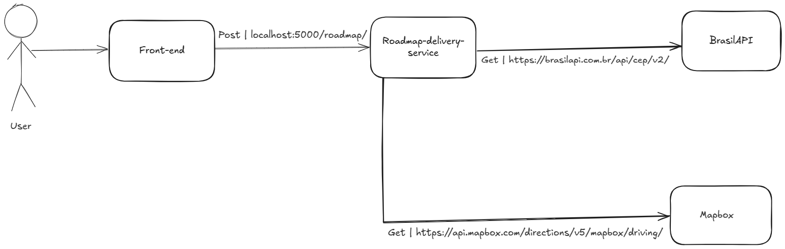

# Roadmap Delivery Service 
 

This is a project created to calculate latitude and longitude from multiples ceps in order to send a response back showing a roadmap which cep you should go first through your current location

## Content Tables

- [Architecture](#Architecture)
- [Features](#features)
- [Instruções de execução](#instruções-de-execução)
- [Contribua com o projeto](#contribua-com-o-projeto)
- [Extra](#extra---adicione-badges)

## Architecture

# 1.0.0
Here there's a big overview of the architecture in our initial version

## Features

TBD

## Settings to execute this project

TBD
